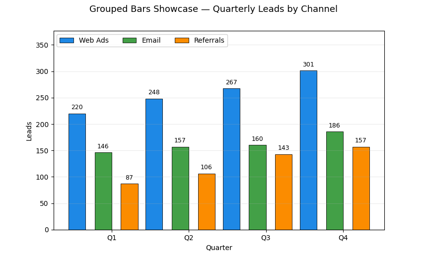

# Grouped Bars Showcase

An original, GitHub‑ready mini‑project that demonstrates **grouped bar charts** with:

- Clean spacing and centering around category ticks
- Custom color palette and crisp edges
- Auto value labels on every bar
- A simple synthetic dataset (quarterly leads by channel)
- Optional PNG export to embed in your README

## Run it

```bash
python grouped_bars_showcase.py
```

## Save a preview image for GitHub

```bash
python -c "import grouped_bars_showcase as g; g.main(save_png=True)"
```

This writes **grouped\_bars\_showcase.png** next to the script. Add it to your README:

```markdown

```

## Requirements

- Python 3.8+
- `matplotlib`, `numpy`

Optional `requirements.txt`:

```
matplotlib
numpy
```

## Why this is safe to publish

- Uses **self‑generated data** and a **distinct plotting style**
- Standalone script — **no course scaffolding**
- Cleanly structured and documented like a proper open‑source example

## Files

- `grouped_bars_showcase.py` — main script
- `README_grouped_bars_showcase.md` — this file

## License

MIT

